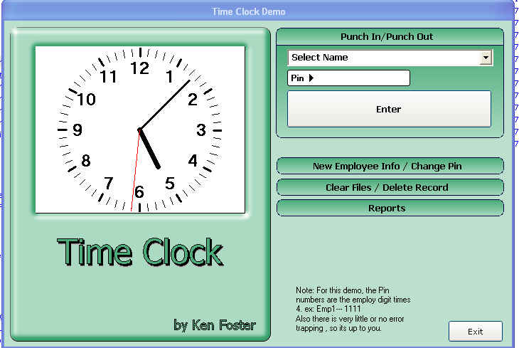



## Time Clock \(Update 1\)

### Description

Keeps track of Punch In and Punch Out times.Lots of room for improvements. This should be a low interest item, but had fun doing it anyways.Sorry, but could'nt remember who coded the analog clock.

Update1: streamed lined the code a little and reformatted the report and printout.
 
### More Info
 

             |
---                |---
**Submitted On**   |2008-07-08 20:27:12
**By**             |[Kenneth Foster](https://github.com/Planet-Source-Code/PSCIndex/blob/master/ByAuthor/kenneth-foster.md)
**Level**          |Intermediate
**User Rating**    |4.8 (24 globes from 5 users)
**Compatibility**  |VB 6\.0
**Category**       |[Miscellaneous](https://github.com/Planet-Source-Code/PSCIndex/blob/master/ByCategory/miscellaneous__1-1.md)
**World**          |[Visual Basic](https://github.com/Planet-Source-Code/PSCIndex/blob/master/ByWorld/visual-basic.md)
**Archive File**   |[Time\_Clock211986782008\.zip](https://github.com/Planet-Source-Code/kenneth-foster-time-clock-update-1__1-70789/archive/master.zip)

